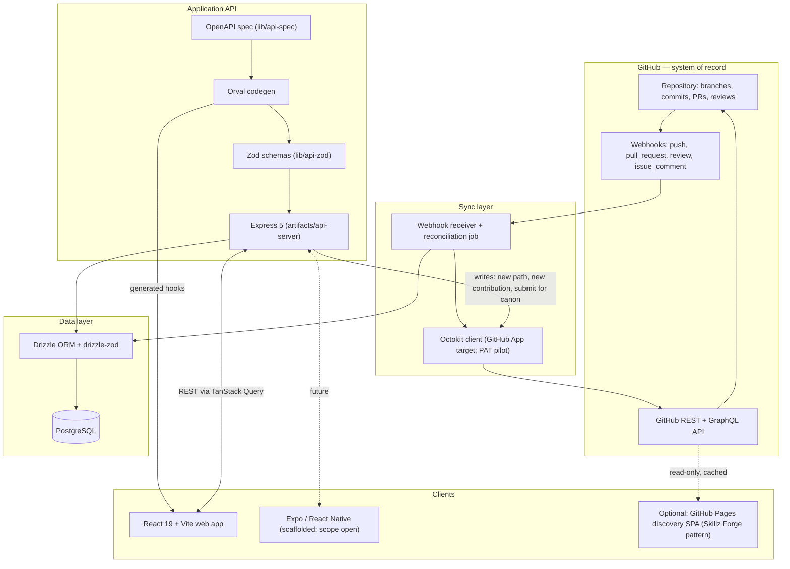

# Telling Forward: Platform Requirements

## GitHub-Backed Community Storytelling Interface

| | |
|---|---|
| **Repository** | [OKHP3/telling-forward](https://github.com/OKHP3/telling-forward) |
| **Suite** | OverKill Hill P³ |
| **Status** | Draft requirements, written against the current repo scaffold |
| **Date** | 2026-08-17 |
| **Related docs** | `README.md`, `docs/MISSION.md`, `CONTRIBUTING.md`, `CONTENT-LICENSE.md`, `AGENTS.md`, `replit.md` |

This document was written from the actual state of the repo, not from a blank concept. Claims are labeled **Confirmed** (verified against a file in the repo), **Recommended** (a decision this document is proposing), or **Open question** (unresolved, needs a project-owner call). Don't let a stale copy of this doc drift from the code; re-verify before relying on it.

---

## 1. Purpose

Telling Forward needs a requirements baseline for one specific problem: how does a voice-first, agent-assisted storytelling product use GitHub as its system of record without ever asking a contributor to think in Git.

This document specifies:

1. How the platform sits on top of GitHub as an alternate UI.
2. How commits and pull requests get reprojected into a community interface (activity feed, review, canon selection, provenance), with selected GitHub-native metadata and checks used as complementary projections.
3. The underlying technology already committed to in the repo, and what's still open.

It deliberately reuses the governance and packaging patterns already proven in the `skillz` repo, since Jamie asked for this app to carry forward functions, features, technology, and methods from that project. Section 9 makes that lineage explicit.

---

## 2. Confirmed starting state

Pulled directly from the repo as of this writing:

- **Product concept** (`README.md`, `docs/MISSION.md`): open-canon collaborative fiction. An originating author opens a storyworld; contributors extend it through distinct paths; readers follow narrative lineage without confusing a community branch with the author's canon.
- **Backstage/front-of-house split** (`README.md`): "GitHub branches, commits, pull requests, and reviews may remain the backstage implementation for an early prototype." Public language is **story seed**, **path**, **branch**, **proposed canon**, **alternate continuity** — never Git jargon.
- **Contribution states** (`CONTRIBUTING.md`): personal work, open path, proposed canon, published alternate path.
- **Content boundary** (`CONTENT-LICENSE.md`): all rights reserved by default on creative content; platform code may get a separate open-source license later; repository visibility is not reuse permission.
- **Monorepo scaffold**: pnpm workspace, Node 24, TypeScript 5.9, already wired for Express 5 + PostgreSQL/Drizzle on the backend and Vite + React 19 + Tailwind v4 on the frontend (full detail in Section 8).
- **GitHub workspace sync is built**: every Replit commit auto-pushes to `github.com/OKHP3/telling-forward` via a `post-commit` git hook, authenticated through `scripts/git-askpass.sh` reading a `GITHUB_PAT` Replit secret. The token never touches git config, files, or process arguments. Separately, the checkout now contains a GitHub-backed application read/write and reconciliation layer; live GitHub repository exercise remains an evidence gap.
- **Product implementation exists in the data, API, and client layers.** `lib/db/src/schema/`, `lib/api-spec/openapi.yaml`, `artifacts/api-server`, `artifacts/web`, and `artifacts/mobile` contain storyworld, path, contribution, proposal, provenance, authentication, reader, steward, capsule, and narration capabilities with automated API tests. `artifacts/mockup-sandbox` remains a design sandbox and is not a production frontend.

Everything in this document past this point is new design built on that foundation.

---

## 3. Design principle: GitHub is the system of record, Telling Forward is the interface

The product does not replace GitHub. It replaces the experience of using GitHub for people who will never open a terminal.

GitHub keeps doing what it's good at: durable version history, branch isolation, diffing, pull request review, access control, audit trail. Telling Forward's job is projection: read the repository's structure and activity, translate it into storytelling vocabulary, and write back to GitHub through the same primitives (commits, branches, PRs) so the canonical history stays intact and auditable outside the app too.

This is the same relationship the `skillz` repo already runs in production: **Skillz Forge** (a Vite SPA on GitHub Pages, `okhp3.github.io/skillz`) is "interactive discovery, comparison, stack composition, sharing, and contribution routing" over the `OKHP3/skillz` repository, while GitHub itself stays the canonical source for `SKILL.md` files, history, issues, and pull requests. Telling Forward is the same shape, applied to fiction instead of skills.

---

## 4. Terminology mapping

The public interface must never surface the left column. Every screen, notification, and API-facing label uses the right column.

| Git / GitHub primitive | Product term | Notes |
|---|---|---|
| Repository | Storyworld | One repo per storyworld (Decided 2026-08-19; see `docs/decisions/open-questions.md` 15.1) |
| Root branch / protected branch | Canon | The originating author's protected continuity |
| Feature branch | Path | A contributor's continuation or divergence |
| Commit | Saved moment | Contributor-facing term per ADR-0001. `Contribution` is the internal data-model and API name for the same record (Section 8's `contributions` table); it must not surface as UI copy for a commit |
| Pull request | Story submission / proposed canon | A request to merge a path into canon or into a shared branch |
| PR review / review comments | Editor question | Feedback attached to a proposed contribution |
| Merge | Accepted into canon | Canon-changing event; must be steward-gated |
| Merged branch kept separate (no merge to canon) | Published alternate path | Visible continuity that never overwrites canon |
| CODEOWNERS / branch protection rule | World steward | Person or org with permission and moderation authority over a storyworld |
| Commit author / PR author | Contributor | Attribution identity, not necessarily a GitHub-literate one (see 7.2 on identity) |
| Git tag / release | Published edition | A frozen, citable version of a canon state |
| Fork | Personal work / open path copy | Depends on whether the source explicitly permitted continuation |

This table is itself a requirement: any new feature must be checked against it before it ships copy that says "commit," "branch," "PR," or "merge" on a contributor-facing screen.

---

## 5. System architecture

**Layers, in plain terms:**

1. **GitHub** stays the durable store. Nothing about a storyworld's history lives only in Postgres.
2. **Sync layer** listens to GitHub webhooks (`push`, `pull_request`, `pull_request_review`, `issue_comment`) and supports reconciliation against the REST/GraphQL API, because webhooks can be missed or arrive out of order. The checkout contains this prototype layer; live GitHub repository and deployment evidence remain separate gates.
3. **Data layer** is a read-optimized cache and query index, not a second source of truth. Every row traces back to a GitHub object (commit SHA, PR number, branch ref) so the cache can be rebuilt from GitHub at any time.
4. **Application API** is the Express 5 + OpenAPI + Orval + Zod pipeline. It serves the cached, human-shaped view to clients and proxies writes (new contribution, submit for canon, steward decision) back through Octokit so GitHub remains authoritative. Private consent and moderation records remain application-owned control-plane data when those designs are implemented.
5. **Clients** are the React 19/Vite web app (primary), an Expo mobile client scaffold with discovery, reading, narration, and offline-cache capability, and several configured reader-oriented web surfaces. Mobile product scope and production deployment evidence remain open. A separate GitHub Pages discovery SPA remains optional.

---

## 6. GitHub integration layer requirements

### 6.1 Authentication

**Decided (2026-08-19, Jamie Hill, PRD Build Directive v1 §4):** Migrate to a GitHub App for the platform's read/write integration. A GitHub App gives per-installation, per-repository scoped permissions, higher rate limits than a PAT, and short-lived installation tokens instead of a long-lived personal token. The current PAT-via-`git-askpass.sh` pattern is acceptable for the single private pilot but is scheduled tech debt within Stage 1. Keep `GITHUB_PAT` only for the workspace's own auto-push; never reuse it as the platform's service identity.

**Decided (2026-08-19, Jamie Hill, PRD Build Directive v1 §4):** One GitHub repository per storyworld. New storyworlds are created from a template repo ("Storyworld Kit"). See `docs/decisions/open-questions.md` 15.1 and 15.6.

The current checked-in baseline for that kit is
`content/pilot-storyworld/`. It supplies the world manifest, invite-only
contribution and canon policies, provenance convention, canonical
`capsule:<type>` and `state:*` labels, issue and pull-request forms,
maintainer CODEOWNERS template, branch-protection prerequisites, and a
read-only structural validation Action. A new pilot repository must run
`scripts/validate-storyworld-kit.mjs` before steward configuration is
considered complete.

### 6.2 Read path

- Use **Octokit** (`@octokit/rest` + `@octokit/graphql`) from the Express API, not raw `fetch` against the GitHub API. It handles pagination, retry-after, and typed responses.
- Prefer **GraphQL** for anything that would otherwise require N+1 REST calls: a path's full commit list with author and timestamp, a PR with its reviews and review comments in one round trip.
- Cache aggressively. GitHub's REST rate limit (5,000 req/hr for an installation token, higher for GraphQL point budget) is generous for a small platform but not for a "refresh on every page view" pattern. The Postgres cache from Section 5 is the read path for the UI; GitHub API calls happen in the sync job and on explicit write actions, not on every page load.

### 6.3 Write path

Every contributor-facing action maps to a specific GitHub write, executed server-side by the API (contributors never get a GitHub token):

| Product action | GitHub operation |
|---|---|
| Start a new path from a story seed | Create branch from the seed's current canon ref |
| Submit a contribution | Create commit (via Contents API or a tree/blob sequence for multi-file changes) on the contributor's path branch |
| Propose for canon | Open a pull request from the path branch to canon, with a structured PR body template |
| Leave an editor question | Create a PR review comment |
| Accept into canon | Merge the PR (steward-authorized only, see 6.4) |
| Publish as alternate path | Close the PR without merging, tag the branch, keep it discoverable as a separate continuity |

### 6.4 Steward authority

World steward permission should be enforced **twice**: once in GitHub (branch protection rule on canon requiring a review from a designated user/team, or CODEOWNERS on the canon path) and once in the application layer (a `stewards` table gating which product actions render as available). Do not rely on GitHub permissions alone — a steward's product-level authority (canon policy, moderation) is broader than "can merge a PR," and the UI needs to reason about it independent of a live GitHub permissions check on every render.

The kit's `.github/branch-protection.md` records the defense-in-depth setup,
including protected canon branch, required steward review, required
`validate-storyworld` status check, and the prerequisite that the GitHub
organization and plan actually support CODEOWNERS and required-review rules.
The validation Action has `contents: read` only and may reject malformed
metadata, but it may not merge, publish, accept canon, or decide rights.

### 6.5 Idempotency and drift

The sync job must be safe to re-run and safe to fall behind. Every ingested object (commit, PR, review) is keyed by its GitHub-native identifier (SHA, PR number + repo) so re-processing a webhook delivery or a reconciliation pass is a no-op if nothing changed. Never treat the Postgres cache as authoritative if it disagrees with GitHub; GitHub wins, and a drift-detection pass should be part of the reconciliation job, not an afterthought.

---

## 7. Community interface requirements

### 7.1 Activity feed (commits → contribution feed)

The commit history of a path, reprojected as a chronological feed: contributor, timestamp, a human summary (not the raw commit message unless the contributor wrote it in plain language), and a link to the actual contribution. This is the "social feed" surface — the part of the product that makes the platform feel alive rather than like a file browser.

- Feed entries are generated from commits, but the copy layer must translate. A commit message is developer-facing metadata, not the product's voice; the platform needs its own structured contribution record (title, summary, contributor note) stored alongside the commit SHA it corresponds to, not derived from `git log` output at render time.
- **Durability requirement:** because Section 3 and Section 6.5 promise that the Postgres cache is rebuildable from GitHub, the structured contribution record and platform-native attribution must also be stored durably in GitHub, not only in Postgres. Write them into the commit itself: structured commit trailers (title, summary, `Co-authored-by` or a custom attribution trailer for platform-native contributors) and, for anything larger, a committed metadata file alongside the content. Postgres indexes this data for fast reads; GitHub remains the source it can be rebuilt from. If a field is ever intentionally Postgres-only, that exception must be documented here along with its backup and recovery guarantee.
- Support filtering by storyworld, by path, and by contributor.
- Provenance must be visible inline: which contribution, by whom, under what permission state (personal work / open path / proposed canon / published alternate path).

### 7.2 Contributor identity

**Decided (2026-08-19, Jamie Hill, PRD Build Directive v1 §4, decision 15.2):** App-native identity is sufficient for Stage 0–1. Contributors sign up with email/OAuth on the platform; the API commits on their behalf using the GitHub App's installation identity, storing the real contributor as commit trailer metadata (`Co-authored-by` or a custom trailer) and in the Postgres attribution table. Optional GitHub OAuth linking is available for contributors who want their name on the actual commit author field, but it is not required.

This matches the stated voice-first, non-technical audience: no GitHub literacy required. Attribution lives in the app's data model (the `contributors` table and provenance records), which must be treated as carefully as Git history itself. A full contributor identity model (e.g. federation, GitHub-native primary authorship, adaptation-rights linking) is Stage 2/3 work and should not be designed or built in Stage 0–1.

### 7.3 Review as editorial process (PRs → proposed canon)

A pull request is the unit of editorial review. The interface needs:

- A submission view that reads like an editorial pitch, not a diff: what's being proposed, why, and what it changes, with the actual text diff available but not the primary surface.
- Editor questions (PR review comments) threaded against specific passages, not raw line numbers.
- A clear state machine for the contributor, and this is the single authoritative model (ADR-0001's status list and ADR-0002's notification states map onto it as noted):
  - **Draft**: not yet submitted (no PR exists).
  - **Submitted**: PR opened; maps to ADR-0002 notification 1 ("We received your scene").
  - **Under review**: steward review in progress; maps to ADR-0002 notification 2.
  - **Returned with notes**: an editor question is waiting on the contributor; not a terminal state, the submission returns to Under review once answered. Maps to ADR-0002 notification 3 ("We have one creative question for you").
  - **Accepted into canon**: terminal; maps to ADR-0002 notification 4.
  - **Published as an alternate path**: terminal; maps to ADR-0002 notification 5.
  - Accepted into canon and Published as an alternate path are mutually exclusive terminal outcomes of the same review, not a sequence. ADR-0001's arrow notation ("Draft → Under review → Accepted into canon → Published as an alternate path") lists the possible statuses in rough order; it does not mean an accepted submission later becomes an alternate path.
  - This is a UI simplification over PR states (open, changes requested, approved, merged, closed) that must be maintained explicitly, not inferred ad hoc per screen.

Withdrawal, attribution changes, restriction, archive, and deletion are not
interchangeable proposal states. Their authority, reader visibility, and
preservation requirements are defined in
`docs/decisions/withdrawal-preservation-policy.md`; no implementation may infer
deletion, orphaning, or derivative permission from `withdrawn`.

### 7.4 Canon selection and provenance ledger

Every accepted-into-canon event must produce a durable, queryable provenance record: source path, contributor(s), reviewing steward, timestamp, and the resulting canon commit SHA. This is required by `CONTRIBUTING.md`'s attribution and rights-tracking commitments, not optional polish — it is the record any future adaptation-rights conversation would need to point to.

---

## 8. Data model requirements

Sketch of the tables `lib/db/src/schema/index.ts` needs, following the existing `pgTable` + `drizzle-zod` insert-schema pattern already documented in that file's comments:

| Table | Key columns (indicative) | Purpose |
|---|---|---|
| `storyworlds` | id, repo_owner, repo_name, title, steward_id, canon_branch_ref | One row per GitHub repository acting as a storyworld |
| `story_paths` | id, storyworld_id, branch_ref, title, origin_path_id, state (personal / open / proposed / published-alternate) | Maps to a GitHub branch |
| `contributions` | id, path_id, commit_sha, contributor_id, title, summary, created_at | Maps to a commit; the human-facing feed record |
| `proposals` | id, path_id, pr_number, state, submitted_at, decided_at | Maps to a pull request |
| `editor_questions` | id, proposal_id, review_comment_id, body, resolved | Maps to PR review comments |
| `stewards` | id, storyworld_id, user_id, role | Application-level authority, cross-checked against GitHub branch protection |
| `contributors` | id, display_name, platform_identity, github_identity (nullable) | Resolves the identity question from 7.2 |
| `provenance_records` | id, storyworld_id, canon_commit_sha, source_path_id, contributor_ids[], steward_id, decided_at | The durable ledger from 7.4 |

Every table that references a GitHub object should store the GitHub-native key (SHA, PR number, branch ref) alongside the application ID, so the cache is always re-derivable and auditable against GitHub directly.

---

## 9. Reused technology and methods from Skills

Jamie asked this app to carry forward what already works in `skillz`. Here is the explicit mapping, not a vague gesture at "reuse stuff":

| `skillz` pattern | Where it lives today | How Telling Forward reuses it |
|---|---|---|
| GitHub repo as canonical source, SPA as alternate UI | Skillz Forge (`okhp3.github.io/skillz`) over `OKHP3/skillz` | Section 3's whole design principle. Same relationship, applied to storyworlds instead of skills. |
| Vite + React + GitHub Pages deployment runbook | `universal/okhp3-vite-github-pages` skill (proven on the Abrahamic Reference Engine) | Directly applicable if the optional public discovery SPA (Section 5, `PAGES` node) gets built: same `base` path handling, `BrowserRouter` basename fallback, Actions-based Pages deploy, 404.html SPA fallback. |
| Machine-readable manifest (`skillz.manifest.json`) with maturity and evidence tiers | Repo root of `skillz` | Recommended: a `telling-forward.manifest.json` (or a `/api/manifest` endpoint) describing each storyworld's maturity (seed / active / dormant) and evidence status (unreviewed / steward-reviewed / published), the same separation `skillz` draws between "draftable/skeleton/usable" and "historical/not-run/live." Gives the platform a machine-checkable status surface instead of only prose. |
| `AGENTS.md` as always-on routing index, `README.md` as human catalog | Root of every OKHP3 repo, including this one already | Already adopted in `telling-forward/AGENTS.md`. Keep maintaining both as the product grows; don't let `AGENTS.md` go stale the way the "Known gaps" section already flags as a risk. |
| Family groupings (`FAMILY.md` per topic cluster) | `skillz/*/FAMILY.md` | Analogous concept for storyworld genres or steward groups, if the platform ever needs to cluster related worlds for discovery. Not required for v1; noted for the roadmap. |
| Confirmed / Inferred / Unknown evidence labeling, safe-change procedure, ROY principle, no-em-dash and standalone-line style | House convention across OKHP3 docs, explicit in `telling-forward/AGENTS.md` | Applied throughout this document. Keep applying it to future product and engineering docs in this repo. |
| Skill-mirror sync script pattern (`.agents/skills/okhp3-skill-promotion/scripts/sync_skill_mirror.py`) | Already present in `telling-forward/.agents/skills/` | Precedent for the GitHub sync job in Section 6: a script that reconciles a local/cached representation against a canonical source and is safe to re-run. Worth reading before building the webhook reconciliation job — the shape of the problem is the same. |
| `pnpm-workspace.yaml` catalog + platform-pruning overrides pattern | `skillz` and now `telling-forward` root | Already carried over verbatim. Keep it in sync as a shared convention if either repo's build targets change. |

---

## 10. API and codegen requirements

The repo has already committed to a specific contract-first pipeline. Requirements here are about extending it correctly, not choosing a new one:

1. All new endpoints get added to `lib/api-spec/openapi.yaml` first, not written ad hoc in Express route handlers.
2. Run `pnpm --filter @workspace/api-spec run codegen` (Orval) to regenerate `lib/api-zod` (Zod schemas, request/response types) and `lib/api-client-react` (React Query hooks) from the spec. Hand-written client-side fetch calls are a regression against the established pattern.
3. Express route handlers in `artifacts/api-server/src/routes` validate incoming requests against the generated Zod schemas before touching Drizzle.
4. `drizzle-zod` generates insert/select schemas directly from the Drizzle table definitions in `lib/db`, so a schema change propagates: Drizzle table → drizzle-zod schema → (if exposed over the API) OpenAPI spec → Orval-generated client types. Keep that chain in that order; don't let the OpenAPI spec drift from the actual Drizzle schema.

---

## 11. Frontend requirements and technology stack

Directly answering the "Vite, Tailwind, TypeScript, Playwright" question: here's what's already decided in the repo versus what's still open.

| Layer | Confirmed choice | Version (from `pnpm-workspace.yaml` catalog) | Status |
|---|---|---|---|
| Language | TypeScript | 5.9 | Confirmed, repo-wide |
| Build tool | Vite | ^7.3.2 | Confirmed, in `artifacts/mockup-sandbox` |
| UI framework | React | 19.1.0 (pinned exact, for Expo compatibility) | Confirmed |
| Styling | Tailwind CSS v4 via `@tailwindcss/vite` | ^4.1.14 | Confirmed |
| Component primitives | Radix UI + shadcn/ui component set | various | Confirmed — full shadcn kit already vendored in `artifacts/mockup-sandbox/src/components/ui` |
| Utility styling helpers | `class-variance-authority`, `tailwind-merge`, `clsx` | catalog-pinned | Confirmed |
| Routing | `wouter` | ^3.3.5 | Confirmed — lightweight alternative to react-router |
| Data fetching/cache | `@tanstack/react-query` | ^5.90.21 | Confirmed |
| Animation | `framer-motion` | ^12.23.24 | Confirmed |
| Icons | `lucide-react` | ^0.545.0 | Confirmed |
| Validation | Zod | ^3.25.76 (`zod/v4` API surface) | Confirmed, shared client/server via `lib/api-zod` |
| API codegen | Orval | — | Confirmed, see Section 10 |
| Backend framework | Express | ^5 | Confirmed |
| ORM | Drizzle ORM + `drizzle-zod` | ^0.45.2 | Confirmed |
| Database | PostgreSQL | — | Confirmed |
| Build/bundle (server) | esbuild | 0.27.3 (pinned) | Confirmed |
| Runtime | Node.js | 24 | Confirmed |
| Mobile | Expo / React Native | — | **Scaffolded and implemented in checkout; product scope and production acceptance remain open** |
| E2E testing | **Not present** | — | **Gap.** No Playwright or Cypress browser harness is configured |
| Unit/integration testing | **Present for API and core flows** | Vitest route and library tests under `artifacts/api-server/src/**/__tests__` | Expand coverage and keep the generated API contract aligned |
| API mocking for tests | Mock Service Worker (`msw`) | listed in `pnpm-workspace.yaml`'s `allowBuilds` map | **Reserved but unused** — the dependency is pre-approved for pnpm's build-script allowlist, but nothing consumes it yet |
| GitHub integration | GitHub client, webhooks, admin reconciliation, and indexed provenance | prototype layer present; GitHub App migration not complete | **Implemented in checkout; live repository and GitHub App evidence deferred** |
| Public discovery SPA | GitHub Pages + Vite (Skillz Forge pattern) | separate configured reader surfaces exist; Pages-specific SPA remains optional | **Recommended, optional**, Section 5 and 9 |

**Recommendation on Playwright specifically**, since it was named directly: adopt it for end-to-end coverage of the contribution → review → canon-acceptance flow once that flow exists. This product's core risk isn't a broken button, it's a broken editorial state machine (a proposal stuck between "submitted" and "accepted," a canon merge that doesn't produce a provenance record). That's exactly the class of bug Playwright's real-browser, multi-step flow testing catches and unit tests don't. Pair it with Vitest for the component and API-handler layer, and MSW (already reserved) to mock the GitHub API boundary in tests so test runs don't depend on live GitHub calls or rate limits.

`artifacts/mockup-sandbox` is a Replit design-mockup sandbox, not the production app shell. The decision log designates `artifacts/web` as the canonical Author App integration candidate and keeps the sandbox disposable. Keep that package boundary intact; promoting the sandbox directly would drag Replit-mockup-specific plumbing (`mockupPreviewPlugin.ts`, `.generated/mockup-components.ts`) into production code that does not need it.

---

## 12. Non-functional requirements

- **Secrets.** Never place a GitHub token, OAuth secret, or database credential in tracked files, workflow YAML, or skill/agent output. Continue the existing `GIT_ASKPASS` pattern for the workspace's own push; use environment-injected secrets (Replit secrets in dev, a proper secrets manager in any future non-Replit deployment) for the GitHub App's private key and webhook signing secret.
- **Auto-push awareness.** Every commit in this Replit workspace pushes to GitHub immediately (Section 2). Treat every commit as effectively public the moment it's made — this applies to this requirements document too once it's committed.
- **Content boundary.** The platform's code, schema, and infrastructure are not covered by the same rights posture as story content. Never let a feature (e.g., an "export storyworld" tool) treat repository-visible content as reuse-permitted; enforce the `CONTENT-LICENSE.md` boundary at the API layer, not just in documentation.
- **Accessibility.** Voice-first framing implies the interface needs to work well for people who aren't going to read dense text either. Component choices (Radix primitives, already accessible by default) support this; don't regress it with custom components that skip ARIA semantics.
- **Rate limits and caching.** Section 6.2's caching requirement is also a non-functional one: the product can't take a GitHub API outage or rate-limit event down with it. The Postgres cache should let read paths degrade gracefully (serve last-known state) if GitHub is unreachable.

---

## 13. Testing strategy

| Layer | Tool | Status | Priority |
|---|---|---|---|
| Unit (schema, business logic) | Vitest | Present for API and core flows | Continue expanding coverage around state transitions and sync behavior |
| API contract | Generated Zod schemas + Vitest against Express handlers | Present for API routes and generated contracts | Keep the generated API contract aligned with route behavior |
| GitHub API boundary | MSW (already reserved in `pnpm-workspace.yaml`) | Reserved, unused | Recommended — mock Octokit calls in tests |
| End-to-end / editorial workflow | Playwright | Not present | Recommended once the submission → review → canon flow exists (Section 7.3) |
| Type safety | `tsc --build` (already wired via `pnpm run typecheck`) | Confirmed, working | Keep as-is |

---

## 14. Deployment and environments

- **Confirmed:** Replit autoscale deployment (`.replit`), Node 24, `pnpm store prune` as a post-build step, ports 8080 (app) and 8081→80 (external).
- **Confirmed:** GitHub sync is currently one-directional (workspace → GitHub via post-commit hook). The read/write GitHub integration in Section 6 is new infrastructure, not an extension of that hook.
- **Confirmed:** `.github/workflows/deploy-pages.yml` builds and publishes `artifacts/web` to `https://okhp3.github.io/telling-forward/` with a Vite subpath base and SPA fallback. GitHub Pages hosts the client artifact only; API-backed behavior remains dependent on the optional `TELLING_FORWARD_API_BASE_URL` repository variable.
- **Recommended, optional:** if the public discovery SPA (Section 5, 9) gets built, deploy it independently via GitHub Actions to GitHub Pages, following `okhp3-vite-github-pages` exactly — client-only, no secrets in the build, base-path and router basename handled per that skill's contract. Keep it decoupled from the Replit-hosted API/DB deployment; it should degrade to "browse cached public data" if the main platform is down.

---

## 15. Known gaps and open questions

The primary decisions log is `docs/decisions/open-questions.md`. The items below reflect current status; see that file for full decision text and rationale.

| # | Topic | Status |
|---|---|---|
| 15.1 | One repo per storyworld | **Decided 2026-08-19** — one repo per storyworld, Storyworld Kit template |
| 15.2 | Contributor identity model | **Decided 2026-08-19** — app-native identity sufficient for Stage 0–1; full model is Stage 2/3 |
| 15.3 | Production web app package | **Decided 2026-08-19** — `artifacts/web` is the canonical Author App candidate |
| 15.4 | Code license | **Decided 2026-08-19** — proprietary/all-rights-reserved placeholder; root `LICENSE` file added |
| 15.5 | `attached_assets/` boundary | **Decided 2026-08-19** — `content/pilot-storyworld/` is the authorized location for pilot source material |
| 15.6 | GitHub App vs. PAT | **Decided 2026-08-19** — migrate to GitHub App; PAT is Stage 1 tech debt |
| 15.7 | Mobile scope and timing | Open |
| 15.11 | Four-vs-six submission states | **Decided 2026-08-19** — six-state model locked; four-state references are stale |
| 15.12 | Capsules table / term ledger | **Decided 2026-08-19** — no capsules table; GitHub Issues with `capsule:*` labels are canonical |
| 15.14 | Per-action consent ladder | **Decided 2026-08-19** — design only in Stage 0–1 |
| 15.15 | Baseline moderation tooling | **Decided 2026-08-19** — design only in Stage 0–1 |

Don't convert any remaining Open items into implementation assumptions. Record decisions in `docs/decisions/open-questions.md` when the project owner makes them.

---

## 16. Phased roadmap

Mirrors the staged model already stated in `README.md`, mapped to this document's technical work:

1. **Foundation.** Data model (Section 8), OpenAPI-first API for storyworlds/paths/contributions (Section 10), GitHub sync layer read path (Section 6.2) for a single pilot storyworld repo.
2. **Editorial loop.** Proposal/review flow (Section 7.3), steward authority enforcement (Section 6.4), provenance ledger (Section 7.4). This is the flow Playwright coverage should target first.
3. **Reader experience.** Public-facing path/branch discovery, activity feed (Section 7.1), plain-language state machine across the full terminology table (Section 4), and optional public-edition publishing. GitHub Pages is not the access-control layer for private or restricted material.
4. **Community surface.** Contributor identity resolution (Section 7.2), optional public discovery SPA (Section 5, 9) for unauthenticated browsing and sharing.
5. **Commercial and later mobile scope.** Only after the above earns real usage, per the README's own staged model: adaptation rights, contributor rewards, and the still-open product scope for the Expo mobile client.

---

## 17. Risks and mitigations

| Risk | Mitigation |
|---|---|
| Postgres cache drifts from GitHub's actual state | Idempotent, SHA/PR-number-keyed sync (Section 6.5); reconciliation job, not webhook-only |
| Contributor-facing UI leaks Git terminology | Terminology table (Section 4) enforced as a review checklist item, not just a reference doc |
| GitHub API rate limits under load | GitHub App tokens (higher limits than PAT), aggressive read-path caching (Section 6.2, 12) |
| Canon merge happens without a provenance record | Record a durable pending provenance entry before invoking the GitHub merge, finalize it on merge confirmation, and have the reconciliation job detect and repair any merge that lacks a finalized record (Section 7.4). A single atomic transaction across GitHub and Postgres is not possible, so rely on outbox-style state plus reconciliation, not a follow-up job that can be skipped |
| Secrets leak through the auto-push-on-every-commit workspace behavior | Continue `GIT_ASKPASS` pattern; treat every commit as public; never commit a `.env` or credential file (already an explicit `AGENTS.md` rule) |
| Production app gets built on top of the disposable mockup sandbox | Resolved package-boundary decision: `artifacts/web` is the canonical Author App integration candidate; the sandbox remains disposable |

---

## 18. Next actions

Open questions 15.1–15.6 and 15.11–15.12 were decided on 2026-08-19 by Jamie Hill (PRD Build Directive v1). The following remain as active build or evidence work for Stage 0–1:

- [ ] Build the Storyworld Kit GitHub template repo (PRD §7.1).
- [x] Normalize the capsule Issue label contract across API, MCP server, and ingestion pipeline (Task #71, merged).
- [x] Fix the canon acceptance state bug — accepting a proposal must not set path to `published-alternate` (Task #70, merged).
- [x] Implement proposal restriction, withdrawal, and archive lifecycle (Task #72, merged).
- [x] Design the per-action consent ladder and baseline moderation tooling (Task #73, merged; enforcement remains unapproved).
- [ ] Migrate platform GitHub integration from PAT to GitHub App (PRD §7.9).
- [ ] Add Vitest + MSW tests for proposal state transitions and sync job idempotency.
- [ ] Record production deployment identity and run external route smoke tests for the configured reader, writer, API, and mobile surfaces.
- [ ] Build the Stage 0/1 traceability matrix and dated capability inventory required by the attainable roadmap.
